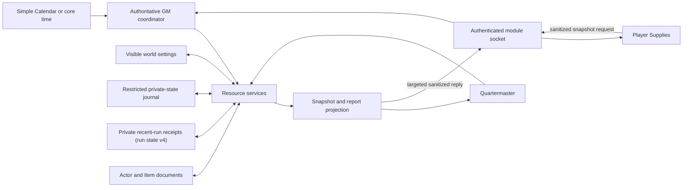

# Resource System Product Roadmap

## v0.3.2 interface quick start

Open **Home → Track the Campaign → Quartermaster**. Start in Today, follow the recommended next action, and review visible safety or disabled-control reasons. **Recent Runs** remains read-only. Open **Setup & Rules** for the first-setup checklist, environments, roster, sources, and automation. Players use Home or `Shift+Q` for the permission-safe Party Supplies view. Offline and interrupted states state whether anything changed and whether to retry or wait for recovery.

## Product outcome

The resource system should make travel supplies part of normal play without
turning every in-game day into bookkeeping.

The finished product has two connected surfaces:

- **Quartermaster** is the GM control center. It configures what the party
  tracks, where supplies are stored, the current environment, automation rules,
  and exceptional actions.
- **Supplies** is the player-facing, read-only overview. It shows the useful
  party state without exposing GM-only matching rules, hidden actor inventory
  details, or privileged controls.

The engine underneath both surfaces must have one source of truth, survive
reloads and client changes, apply inventory changes exactly once, and expose
stable extension points for other modules.

## Product language

Use these terms consistently in code, UI, tests, and release notes:

| Term             | Meaning                                                                         |
| ---------------- | ------------------------------------------------------------------------------- |
| Resource         | A tracked supply such as food, water, or light.                                 |
| Roster           | The actors included in party-resource accounting.                               |
| Consumer         | A roster actor charged one per-character share of daily supplies.               |
| Draw source      | The actor inventory from which a roster member consumes supplies.               |
| Party stash      | One shared draw source for all per-character supplies.                          |
| Environment      | The current travel region and its forage rules.                                 |
| Upkeep run       | One automated or manual operation that consumes supplies for one or more days.  |
| Forage run       | A request, one or more player Survival results, resolved yields, and deposits.  |
| Snapshot         | A sanitized, read-only summary built for UI display.                            |
| Authoritative GM | The one active GM client allowed to resolve runs and write world or actor data. |

## Current product state

The v0.3.2 source has a useful foundation; its installed-world acceptance
status remains bounded by the release gates below.

### Available now

- **Home → Track the Campaign** exposes **Quartermaster** to the full GM.
- Quartermaster opens in a routine-first view with daily actions, location,
  supply outlook, warnings, and the latest report visible. Configuration lives
  in a native **Setup & rules** disclosure that stays open during the current
  window session, resets closed when the window is reopened, and opens
  automatically for a blocking resource-rule conflict.
- Players can open a persistent **Supplies** window from the Infinity D&D5e
  scene controls or the `Shift+Q` shortcut. It requests a fresh, sanitized
  party snapshot from the authoritative GM and has loading, unavailable,
  disabled, and empty states.
- The GM can track food, water, light, custom resources, a curated roster,
  per-member draw sources, and one party stash. A mule, vehicle, or NPC can be
  an inventory-only source without being charged its own daily ration.
- Resource items can be matched by explicit item UUID, module flag, or name
  keyword. Search the Infinity item library and current Actor inventories, or
  use **Paste an Item UUID** for an item from any other world or compendium
  source. UUID and flag matches take priority over keywords.
- Default environments cover abundant, limited, sparse, settlement, underground,
  forest, rainforest, grassland, coast, hills, mountains, swamp, desert, tundra,
  and riverlands travel. The legacy scarcity tiers follow the established
  foraging DCs; biome presets are module starting points, not claimed
  as additional core rules.
- The active environment can be copied into a collision-safe custom region and
  edited in Quartermaster. Custom names, forage availability, separate food and
  water Survival DCs, and bounded food/water yield formulas are validated before persistence;
  built-in presets remain immutable.
- The GM can change the current environment, use one day of supplies without
  moving the world clock, or start a forage-only drive.
- Automatic upkeep can react to Simple Calendar or core world-time day changes.
  Forward jumps are capped, same-day events are deduplicated, and backward time
  does not create negative upkeep.
- Online owners can roll Survival or skip. The authoritative GM resolves yield,
  deposits supplies, consumes resources, records the last report, and can
  suggest exhaustion.
- Inventory planning, calendar math, environment normalization, forage yield,
  roster behavior, and write accounting have focused Node tests.
- Consumption and forage deposits are verified against the Actor's canonical
  inventory after Foundry returns or throws. A mismatched write keeps only the
  amount that can be proven, marks the run **Needs review**, and never labels
  that actor supplied; GM-only detail is removed from the player projection.
- Duplicate forage channels and concrete items claimed by more than one
  resource are diagnosed in Quartermaster and block automation before prompts
  or inventory writes. Deposit templates are simulated too, so a newly created
  stack cannot introduce a hidden overlap. Shared matcher declarations remain
  visible as warnings until a concrete or proposed item makes them ambiguous.
- Socket messages use the transport-authenticated sender and deterministic
  authoritative-GM selection rather than trusting a claimed user ID.
- The GM and player surfaces share one source-aware outlook model, so individual
  packs, nominated stashes, the party stash, and party-wide pools are counted
  consistently.
- Structural configuration is schema version 5. The legacy duplicated runtime
  rules migrate once into the normal visible Foundry settings. Exact former
  defaults are repaired to whole-word ration matching, broad `food` matching is
  removed, reusable Waterskins are no longer disposable water, and customized
  matcher lists remain unchanged.
- GM-only resource structure and moving run state are cached from flags on the
  restricted private-state journal. Legacy world-setting copies are cleared
  only after a successful private migration. New worlds never store those
  values in a player-synchronized setting.
- Moving run-state writes carry a safe monotonic revision plus the current
  authoritative-GM identity and authority epoch. Writes are serialized,
  read back, and recovered after a handoff; stale queued writes and
  equal-revision divergent payloads are rejected and the last accepted state
  is reasserted.
- Daily upkeep and forage writes acquire a persisted, authority-fenced lease
  immediately before the first Actor mutation. Calendar leases reserve the day
  in that same write. A short stabilization window and per-write claim checks
  stop a visible competing or interrupted run for explicit GM review instead of
  replaying the whole operation. The lease snapshots the initiating GM, start
  time, environment, participants, every possible inventory write target, and
  forage assignments/destination so an interrupted receipt identifies each
  character's requested supplies plus the sheets and stashes to review without
  claiming an outcome.
- Quartermaster keeps the newest 20 detailed, read-only receipts for automatic
  upkeep, Use Daily Supplies, Forage Drive, and explicitly acknowledged interrupted
  runs. Receipts are normalized plain data in the private run state. They store
  historical labels, initiating GM, timing, affected actors and inventory
  targets, and accounting outcomes, never Actor or Item documents, match rules,
  raw configuration, or a player-facing socket projection.

### Current limits

- The player Supplies surface and its synthetic responsive fixtures are
  implemented in source, but the milestone still needs installed-world,
  multi-client acceptance proof before it is treated as release-complete.
- The environment catalog now supports the first editor slice: copy and safely
  edit a custom region. Creating a blank region, reordering or removing regions,
  previewing presets, and versioned import/export are not implemented yet.
- Active forage runs live in client memory. A reload, GM handoff, or disconnect
  can lose the pending run even though actor or world state remains.
- The fixed Recent Runs history is inspection-only. It has no operation ledger,
  retry, replay, rollback, filters, or proof that a suggested exhaustion change
  was applied.
- A persisted active-run lease rejects automatic same-day replay and fences
  competing clients after a short propagation check. Foundry Journal updates do
  not provide a server-side compare-and-swap primitive, so this is not a proof
  of atomic mutual exclusion between same-user clients under every network
  partition. There is also not yet a per-operation ledger that can prove or
  automatically resume every individual Actor write after a mid-run failure;
  an interrupted lease therefore fails closed and requires GM review.
- A forage result is bound to the exact prompted user and actor, and its
  Survival total must be a finite integer from -50 through 100 (or exactly zero
  for a skip). The total still originates on the player client and is not
  independently verifiable. A future roll provider should attach a
  GM-verifiable ChatMessage or roll reference before tables treat it as
  tamper-proof.
- Conflict preflight reloads rules and roster routing after player prompts,
  resolves and approves the exact create template for every pending deposit,
  then rechecks the context and simulates both the expected write and its
  create fallback against every active matcher. A final synchronous
  live-inventory conflict check runs immediately before the first write.
  Foundry still cannot make several Actor Item writes one atomic transaction,
  so a concurrent edit after that check can produce a reported partial run.
- Foundry treats Assistant GMs as privileged document readers. The module gives
  them the sanitized Supplies workflow and blocks its privileged actions, but a
  restricted Journal cannot hide its flags from an Assistant using Foundry's
  document tools. Tables that do not trust Assistants with GM data must not
  assign that Foundry role.
- When upgrading an old world that already stored resource details in world
  settings, launch once with players disconnected. Let the active full GM
  complete the verified private-state migration and clear the legacy settings
  before players reconnect.
- The pure test suite is strong, but the resource flow still needs a real
  multi-client Foundry test and release-artifact proof.

## User journeys

### 1. GM first-time setup

1. The GM opens Infinity D&D5e and chooses Quartermaster.
2. The module shows useful defaults for food, water, light, and environments.
3. The GM confirms which roster actors consume a daily share, then chooses
   self-carried supplies, per-member stashes, or one party stash. Dedicated
   storage actors stay on the roster with **Consumes** turned off.
4. The GM checks the visible automation settings and selects the starting
   environment.
5. A preview states what will be consumed in one day and which actors or items
   currently satisfy each resource.
6. Saving produces one canonical configuration. Reopening either Quartermaster
   or Module Settings shows the same rule values.

### 2. Player checks party supplies

1. The player opens **Supplies** from the Infinity D&D5e player UI.
2. The client requests a fresh sanitized snapshot from the authoritative GM.
3. The player sees the current environment, last update, source-aware party
   supply totals, and clear status such as ready, low, or critical.
4. The player never receives resource matching keywords, bound item UUIDs,
   hidden actor item names, item document data, or GM-only controls.
5. If no authoritative GM is online, the window explains that live supply data
   is temporarily unavailable instead of showing stale data as current.

### 3. Automatic day change

1. Simple Calendar or core world time crosses into a new absolute day.
2. The authoritative GM creates a durable upkeep run for the capped number of
   elapsed days.
3. Eligible online players receive forage prompts.
4. Results, skips, disconnects, and timeout outcomes are recorded against that
   run.
5. Yield is resolved and deposited once.
6. Consumption is planned, validated, and applied once.
7. The run closes with a report and a refreshed Supplies snapshot.
8. Repeated hooks, late messages, or reconnects return the recorded outcome and
   do not apply the run again.

The private `forageTimeoutSeconds` value defaults to 120 seconds. An explicit
`0` resolves the response window immediately, which is useful for no-wait
automation and deterministic test worlds.

### 4. Manual upkeep

1. The GM chooses **Use Daily Supplies**.
2. A confirmation names the roster size and explains that the world clock will
   not change.
3. The same durable consumption pipeline used by automatic upkeep runs for one
   day, but the manual action skips forage prompts and gathered deposits.
4. The result appears in Quartermaster, the configured chat audience, history,
   and the player Supplies overview.

Manual upkeep must not be a separate calculation or write path.

### 5. Forage-only drive

1. The GM chooses **Forage Drive**, selects tracked actors, assigns food and
   water together, food only, or water only separately to each forager, and
   reviews the food DC, water DC, and destination.
2. Selected online owners roll or skip. For selected characters whose owners
   are offline, the active GM makes the Actor's Survival roll locally so the
   drive can run between sessions.
3. A dismissed GM fallback roll or timed-out player is recorded as no response,
   not as a failed roll.
4. The authoritative GM checks each roll against only the assigned channels and
   deposits only the chosen supplies. With `best`, homogeneous both-supply runs
   retain the combined-haul rule; mixed runs keep one best food haul and one best
   water haul.
5. No day passes and no daily consumption occurs.
6. A private receipt records every per-forager assignment, both DCs, resolved
   channel outcomes, destination, applied totals, and deposit errors.

### 6. Interrupted run

1. A player or GM reloads while a forage or upkeep run is active.
2. The new authoritative GM reads the durable run.
3. Each player resumes the prompt or result that belongs to an actor they own.
4. The GM resumes from the last completed state transition.
5. Completed deposits or consumption are recognized by their operation keys and
   are not repeated.
6. The run either completes or closes with an explicit partial-failure record.

## Canonical data ownership

Every value must have one canonical owner. UI state and socket payloads are
projections, not competing storage.

| Data                                                                                                          | Canonical owner                                                     | Write authority  | Notes                                                                                                          |
| ------------------------------------------------------------------------------------------------------------- | ------------------------------------------------------------------- | ---------------- | -------------------------------------------------------------------------------------------------------------- |
| Auto-run, player view, default environment, forage mode, water, half rations, catch-up cap, report audience   | Normal Foundry world settings                                       | Full GM          | These are visible rules. Quartermaster and Module Settings must edit the same keys.                            |
| Resource definitions, matching rules, roster, consumer and stash mapping, environment catalog, forage timeout | Versioned `resourceConfig` flag in the restricted private journal   | Full GM          | Structural configuration only. It is never synchronized to player clients.                                     |
| Last seen day, selected current environment, latest report, active lease, recent receipts                     | Versioned `resourceRunState` flag in the restricted private journal | Authoritative GM | Schema v4 retains 20 normalized GM-only receipts; players receive only the latest sanitized upkeep projection. |
| Item quantities and exhaustion                                                                                | Foundry Actor and embedded Item documents                           | Authoritative GM | Actor documents remain the inventory source of truth.                                                          |
| Quartermaster display                                                                                         | Live canonical reads                                                | None             | A privileged projection.                                                                                       |
| Supplies display                                                                                              | Sanitized snapshot from authoritative GM                            | None             | Never persist a client copy as a second source of truth.                                                       |

### Configuration versioning

The current structural resource configuration is version 5. The migration:

1. Detect an unmigrated version 1 configuration.
2. Copy each legacy runtime rule to its visible Foundry setting.
3. Copy the legacy world-setting payload into the restricted private-state
   journal and clear the legacy setting only after the private write succeeds.
4. Repair the exact former built-in food matcher by removing the broad `food`
   keyword, using whole-word ration phrases, excluding water-ration names, and
   binding the core Rations source UUID.
5. Repair the exact former water matcher by removing `waterskin`; reusable
   containers are not disposable day-unit stacks. Customized matcher lists are
   left alone.
6. Infer built-in provenance for the five legacy preset IDs, preserve custom
   collisions, and append missing shipped biome presets without overwriting
   stored labels, DCs, yields, or order.
7. Save only the current structural shape in the private `resourceConfig` flag.
8. Be safe to run more than once.
9. Preserve the old world's customized behavior on the first upgraded launch.
10. Leave malformed or absent fields at registered defaults.

All future changes follow the same pattern: normalize, migrate, serialize the
current schema, then read it back in a test.

The moving `resourceRunState` schema is version 4. It preserves the last seen
day, selected environment, latest upkeep report, active safety lease, and recent
history while adding normalized per-forager assignments to forage leases.
Older latest reports are not reinterpreted as receipts.

## Canonical data flow

Rules for this flow:

- UI classes call services. They do not calculate or mutate inventory directly.
- Socket handlers authenticate, authorize, and validate before calling services.
- Only the authoritative GM coordinates a run or writes actors.
- Calculation functions stay pure where possible. Foundry document writes are
  isolated in adapters and return explicit success or failure accounting.
- A snapshot is always derived from current canonical data.
- Chat is a report sink, not a database.

## Automation event contract

### Existing resource events

| Event                    | Direction     | Purpose                                               | Required checks                                                                            |
| ------------------------ | ------------- | ----------------------------------------------------- | ------------------------------------------------------------------------------------------ |
| `resource:day-prompt`    | GM to player  | Open a forage prompt for one run and actor.           | Sender is authoritative GM; target user, run, and actor are all nonempty.                  |
| `resource:forage-result` | Player to GM  | Return a Survival total or skip.                      | Sender is active; user and actor exactly match the open prompt; bounded total; first wins. |
| `resource:forage-ack`    | GM to player  | Return the resolved yield or timeout outcome.         | Sender is authoritative GM; target user, run, and actor are all nonempty.                  |
| `resource:upkeep-report` | GM to clients | Announce a completed upkeep result and refresh views. | Sender is authoritative GM; payload contains no hidden inventory data.                     |
| `resource:state-update`  | GM to clients | Invalidate open resource windows.                     | Sender is authoritative GM.                                                                |

### Supplies snapshot events

The current milestone adds `resource:overview-request` and the targeted
`resource:overview-reply`. Their contract is:

- A player requests a snapshot with no trusted actor, inventory, or permission
  claims in the payload.
- Requests and replies carry a nonempty, bounded correlation ID. Replies also
  require an explicit target and are accepted only for the currently pending
  request on that client.
- The authoritative GM derives access from the authenticated sender.
- The GM returns only a versioned sanitized snapshot to that user.
- A disabled player-view setting returns a denial or unavailable state, not the
  snapshot.
- State updates invalidate an open Supplies window and cause a bounded refresh.

### Durable event envelope

Before external integrations are supported, every resource event should use a
validated envelope containing:

- `protocolVersion`
- `eventId`
- `type`
- `runId` when part of a run
- transport-authenticated sender identity
- `targetUserId` and `actorId` only when needed
- `stateRevision`
- bounded data specific to that event

Unknown versions, event types, actors, runs, or state revisions fail closed.
Duplicate `eventId` or operation keys return the recorded result.

## Permission boundaries

### Full GM

A full GM may:

- open Quartermaster;
- change settings and structural configuration;
- manage the roster, draw sources, resources, and environments;
- start manual upkeep and forage drives;
- review privileged matching detail and full history;
- approve exhaustion or corrective actions.

### Authoritative GM

Only the authoritative GM client may:

- react to clock changes;
- create, resume, resolve, or close runs;
- accept player results;
- deposit or consume actor inventory;
- update run state and history;
- build and send authoritative player snapshots.

A second GM may inspect and configure the control surface, but run controls
that can write actors must be disabled or clearly redirected while another GM
is authoritative. A warning alone is not enough for actions that can cause
duplicate writes.

### Player and Assistant GM

A non-full-GM user may:

- open Supplies when the setting permits;
- receive only the sanitized snapshot allowed for that user;
- roll or skip only for the exact user-and-actor prompt issued by the
  authoritative GM;
- resume only their own active prompts.

They may not:

- request arbitrary actor inventories;
- choose another actor ID in a trusted payload;
- edit rules, roster, stash, environment, or run state;
- trigger upkeep, deposits, consumption, or exhaustion;
- receive matching keywords, explicit item UUIDs, hidden items, or private
  history through the module's player APIs and UI.

Foundry's own trust boundary is broader: Assistant GMs inherit GM document
access and can inspect restricted Journal flags outside these module workflows.
They must therefore be treated as trusted GM-data readers even though the
resource automation treats them as players and denies privileged mutations.

### Transport and report privacy

- Use Foundry's authenticated socket sender ID as the identity boundary.
- Foundry v13.351's custom-package relay supplies that sender as the second
  listener argument. Resource receivers fail closed if it is absent; reverify
  this core contract when raising the supported Foundry generation.
- Treat payload `originUserId`, actor IDs, totals, modifiers, and targets as
  untrusted input until validated.
- Target player replies explicitly. Do not rely on all clients politely
  discarding privileged data.
- Apply the configured chat audience after the report is built.
- Player-view data and chat-report visibility are separate permissions.

## Delivery phases

### Milestone 1 - Player Supplies, canonical settings, and correctness

This is the current milestone.

#### Deliverables

- Add a player-facing **Supplies** entry to the Infinity D&D5e UI.
- Build the view from a targeted sanitized snapshot generated by the
  authoritative GM.
- Show environment, last-updated state, tracked supply totals, and practical
  low or empty status without revealing matching detail.
- Add a normal world setting that enables or disables the player view.
- Make the visible settings the only canonical owner of forage mode, water,
  half rations, and catch-up days.
- Move GM-only structural configuration and run state into the restricted
  private-state journal. Migrate and clear their legacy world settings only
  after the private copy is confirmed.
- Migrate legacy duplicated rule values into the visible settings and serialize
  only structural configuration afterward.
- Make edits in Quartermaster and Module Settings agree immediately and after a
  reload.
- Deterministically remove duplicate resource IDs and reject other
  configuration shapes that would make accounting ambiguous.
- Keep summary totals aligned with the same consumer roster, draw-source,
  inventory-only stash, and matching logic used by consumption.
- Add focused snapshot, socket authorization, setting migration, store
  round-trip, and player-view tests.
- Add the new window to the static UI harness and responsive UI audit.

#### Milestone exit

The milestone is complete when one GM and two player clients can open their
correct Supplies view, setting changes stay in sync across both configuration
surfaces, player clients cannot read the private resource flags, unauthorized
snapshot requests reveal nothing, and `npm run check`, `npm run format:check`,
and `npm run ui:audit` pass.

### Milestone 2 - Environment editor and presets

The first vertical slice is implemented in source: a GM can copy the current
preset or custom region, immediately activate the copy, and safely edit its
name, forage availability, separate food and water DCs, and food/water yields. The remaining deliverables
below cover full catalog management, preset previews, and portable files.

#### Deliverables

- Add create, duplicate, rename, reorder, and remove actions for environments.
- Keep built-in presets available through reset or copy; do not require code
  edits for a custom region.
- Edit forageability, food DC, water DC, food formula, and water formula with inline
  validation.
- Preview the effect of a preset before applying it.
- Prevent duplicate or blank IDs and unsafe dice formulas.
- If the active environment is removed, require a replacement or fall back in a
  documented, deterministic way.
- Support versioned JSON export and import through validation, with a complete
  preview before save.
- Provide presets for common campaign conditions while keeping the rules
  system-neutral enough for custom tables.

#### Milestone exit

A GM can create a custom region, use it for an upkeep and forage run, export it,
import it into a fresh world, and get the same normalized behavior.

### Milestone 3 - Durable forage resume, idempotency, and history

The first observability slice is complete in source: a fixed, private history
of 20 detailed read-only receipts. The durable state machine, operation ledger,
resume, and provably safe recovery work below remain future slices.

#### Durable run state machine

Use one state machine for automatic upkeep, manual upkeep, and forage-only runs:

`created -> prompting -> resolving -> applying -> completed`

Terminal alternatives are `cancelled` and `failed`. A partial write is recorded
as `failed` with the exact completed operations and recovery action.

#### Deliverables

- Persist active runs before sending the first prompt.
- Record selected actors, expected responders, accepted responses, skips,
  timeouts, resolved yield, planned actor writes, applied operation keys, and
  final reports.
- Resume active prompts after player reload and resume coordination after
  authoritative-GM handoff.
- Make response acceptance, yield deposit, consumption, report posting, and run
  closure idempotent.
- Reject late or replayed results after closure while returning the recorded
  outcome to the sender.
- Extend the fixed read-only history only when additional metadata has a stable,
  privacy-reviewed source; configurable retention and filters are not part of
  the current slice.
- Add a safe retry action only for operations proven not to have been applied.
- Never implement retry as "run the whole day again."

#### Milestone exit

Automated tests can reload the GM or player at every state boundary, replay each
event, and prove that final actor quantities, history, and reports match one
uninterrupted run exactly.

### Milestone 4 - Stable integrations

#### Integration boundaries

Expose versioned service and hook contracts rather than inviting other modules
to edit world settings or call UI handlers.

- Clock provider: Simple Calendar and core world time are adapters to one
  absolute-day contract.
- Inventory adapter: isolates dnd5e actor and embedded-item document shapes.
- Roll provider: isolates system Survival roll details from pure forage math.
- Verifiable roll provider: attaches a GM-verifiable ChatMessage or system-roll
  reference to a forage response and proves that it belongs to the prompted
  user, actor, and run. Until this adapter exists, the bounded player total is
  transport-authenticated input, not proof of a roll.
- Report sink: sends chat and UI notifications from a normalized report.
- Read API: returns privileged or sanitized snapshots according to the caller.
- Command API: offers GM-authorized preview and execute methods for upkeep,
  forage, environment selection, and configuration import.
- Hooks: publish run-created, run-completed, run-failed, and snapshot-invalidated
  events with documented, versioned, read-only payloads.

Optional merchant or travel-module links should consume these APIs. They must
not become hard dependencies of the resource core.

#### Integration rules

- Detect optional modules and versions at runtime.
- Degrade to a useful core workflow when an integration is absent.
- Fail closed before actor writes when an adapter cannot validate its input.
- Do not let external callbacks mutate internal run records.
- Document compatibility and include an integration contract test fixture.

#### Milestone exit

One sample adapter can drive a full preview and run through the public contract
without importing an application class or directly reading private settings.

### Milestone 5 - Live multi-client and release validation

#### Live scenarios

- One GM and one player, then one GM and two players.
- Two active GMs with deterministic authority and a handoff.
- One player owning multiple tracked actors.
- Assistant GM owning a character.
- Player disconnect before prompt, during roll, and after response.
- GM reload during every durable-run state.
- Simple Calendar installed and absent.
- Core time forward one day, forward many days, repeated same day, and backward.
- Shared stash, per-member stash, and self-carried supplies.
- Water disabled, half rations enabled, `each` forage, and `best` forage.
- Missing item, deleted actor, invalid environment, and one failed inventory
  write.
- Player view enabled and disabled, public and whispered reports.

#### Release proof

- Run the complete check, format check, and UI audit.
- Build the release zip with the normal release command.
- Inspect the staged manifest, module version, compatibility range, scripts,
  templates, styles, and compiled pack paths.
- Install the zip into a clean supported Foundry world.
- Run the multi-client smoke journey from the installed artifact, not only the
  source checkout.
- Verify no stale schema, migration, console, socket, layout, or permission
  errors.
- Record the Foundry and dnd5e system versions used for the proof.

## Test matrix

| Layer                  | Required cases                                                                                                                            | Gate                               |
| ---------------------- | ----------------------------------------------------------------------------------------------------------------------------------------- | ---------------------------------- |
| Resource normalization | Defaults, malformed entries, duplicate IDs, invalid scope, invalid rates, idempotent normalization                                        | `npm run check`                    |
| Settings and migration | v1 to v2 copy, registered defaults, repeated migration, Quartermaster-to-settings sync, settings-to-Quartermaster sync, reload round-trip | `npm run check`                    |
| Environment            | Built-ins, CRUD, duplicate ID, formula validation, active deletion, import/export, forage disabled                                        | `npm run check` plus UI audit      |
| Roster and stash       | Auto roster, explicit consumer, inventory-only NPC stash, missing actor, self draw, per-member stash, party stash, stale references       | `npm run check`                    |
| Item matching          | UUID over flag over whole-word keyword, water-ration exclusion, spell/scroll false positives, reusable Waterskin, pack-wide names         | `npm run check`                    |
| Consumption            | Exact stack, multi-stack, delete at zero, shortfall, party resource, half rations, water disabled, multi-day cap                          | `npm run check`                    |
| Deposit                | Existing stack, create default stack, no template, shared stash, per-forager destination, partial document failure                        | `npm run check`                    |
| Forage math            | Success, failure, negative Wisdom result clamp, dry region, each mode, best mode, offline, skip, timeout                                  | `npm run check`                    |
| Calendar               | First seed, same-day dedupe, forward jump, capped jump, backward time, Simple Calendar fallback                                           | `npm run check`                    |
| Snapshot privacy       | Correct totals, allowed fields only, hidden match detail absent, disabled view, no GM online, malformed request                           | `npm run check`                    |
| Socket authority       | Spoofed origin, inactive sender, wrong actor owner, non-authoritative GM, wrong target, unknown event or version                          | `npm run check` plus multi-client  |
| Idempotency            | Duplicate hook/prompt, claim failure before writes, competing lease, failed completion, same-day retry, authority loss                    | `npm run check` plus restart tests |
| Recent run history     | v2 migration, allowlisted receipt shapes, completion/clear atomicity, newest-first dedupe, 20-run cap, player omission                    | `npm run check` plus UI audit      |
| Resume                 | GM reload and player reload at each run state, authority handoff, stale prompt, completed-run replay                                      | Restart harness plus multi-client  |
| Reports and exhaustion | All chat audiences, sanitized player data, shortfall reasons, cap at six, cancelled prompt, failed write visibility                       | `npm run check` plus multi-client  |
| UI                     | GM and player launchers, empty/loading/error/low/healthy states, keyboard, narrow and phone widths, no unreachable controls               | `npm run ui:audit`                 |
| Compatibility          | Supported Foundry and dnd5e versions, Simple Calendar present/absent, optional integration absent                                         | Clean-world smoke                  |
| Release                | Check, format, UI audit, release build, manifest contents, clean install, two-client smoke                                                | Release gate                       |

## Production definition of done

The resource product is production-ready only when all of the following are
true:

- **Discoverable:** GMs find Quartermaster and players find Supplies in the
  Infinity D&D5e UI, with clear loading, unavailable, empty, and error states.
- **Complete:** Setup, viewing, manual upkeep, automatic upkeep, forage-only,
  history, resume, and recovery work without console intervention.
- **Canonical:** Each rule and datum has one source of truth, versioned
  migrations, normalization, and tested read-back.
- **Correct:** The same roster, stash, matching, and rule services power preview,
  display, deposit, and consumption.
- **Exactly once:** Duplicate hooks, socket messages, reloads, and GM handoffs
  cannot duplicate deposits, consumption, exhaustion, history, or chat reports.
- **Private:** Players receive only targeted sanitized projections. All
  privileged actions are enforced at service and transport boundaries, not only
  hidden in the UI.
- **Recoverable:** Interrupted runs resume safely. Partial failures name the
  completed and remaining operations and provide a bounded recovery action.
- **Observable:** GMs can review a bounded history with trigger, initiator,
  actors, environment, totals, failures, and run ID.
- **Extensible:** Stable versioned APIs and hooks exist for clocks, inventory,
  rolls, reports, and optional integrations.
- **Tested:** Pure, store, socket, UI, restart, multi-client, compatibility, and
  release-artifact checks all pass.
- **Documented:** GM setup, player use, migration behavior, permissions,
  integration contracts, troubleshooting, and release proof are maintained with
  the implementation.

## Working rules for future changes

1. Extend the existing resource services; do not create a second supply engine
   for the player UI or an integration.
2. Add or change the pure calculation first, then the Foundry adapter, then the
   application surface.
3. Preview a write plan before applying it and account for every attempted
   document operation afterward.
4. Persist a run transition before emitting the next external event.
5. Add a schema migration and read-back test whenever stored data changes.
6. Add authorization tests whenever a socket payload or public API changes.
7. Add the changed window or state to the UI harness and responsive audit.
8. Prove high-risk changes with at least two live clients before release.
9. Validate the installed release artifact before calling a milestone complete.
